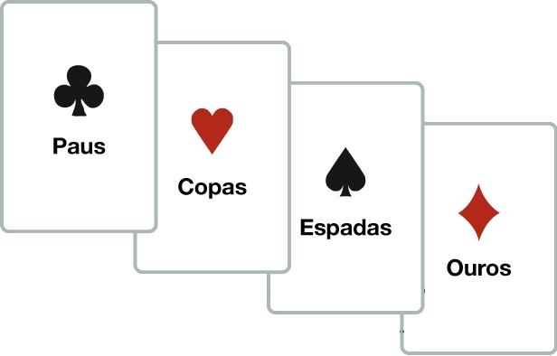
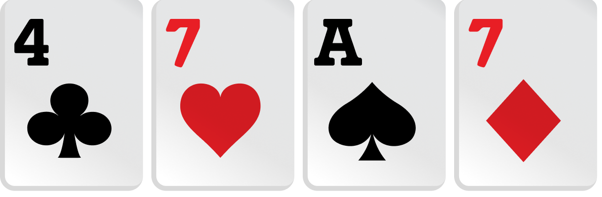
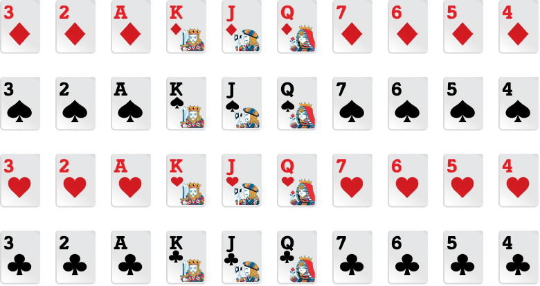

<t1>Truco Mineiro com a Máquina</t1>

Jogue um jogo de cartas feito em Rust.
 

O truco tem suas raízes em jogos de cartas europeus, particularmente na Espanha e na Itália, onde jogos semelhantes eram jogados já no século XV. O truco foi trazido para a América do Sul pelos colonizadores espanhóis e, ao longo do tempo, adaptou-se às diferentes culturas locais, tomando características regionais distintas no Brasil, Argentina, Uruguai e outros países. No Brasil, o truco se popularizou no interior do país, especialmente nas regiões Sudeste (São Paulo e Minas Gerais) e Sul (Paraná, Santa Catarina, Rio Grande do Sul). Em Minas Gerais, ele ganhou um estilo próprio, com suas regras particulares e uma forma de jogar que é diferente do truco paulista e do truco gaudério (jogado no Sul).

Os naipes do jogo também tem força no jogo, sendo o mais forte o paus e o mais fraco o ouros.

As manilhas são as cartas mais fortes do jogo. As cartas mais fortes sempre começa de cima pra baixo, com a mais forte sendo 4 de paus e a mais fraca 7 de ouro.

Abaixo das manilhas tem outras cartas, sendo todas mais fracas que as maninhas, sendo a mais forte o 3 e a mais fraca sendo o 4 (o 4 sem ser do naipe de paus).

<h1>Truco</h1>
 
<t1>Pontos</t1>

O jogo é definido em 3 rodadas em cada partida, quem ganhar duas rodadas ganha a partida. Pra vencer o jogo precisa de 12, quando você ganha uma partida ganha 1 ponto da forma normal, quando alguem pede "truco", a pesssoa tá pedindo pra subir de 1 ponto para 3 pontos, quando isso acontecer o jogador que tá sendo pedido para aumentar os pontos ele deve escolher se vai subir ou não, se ele aceitar o truco(pedido para aumentar os pontos para quem ganhar de 1 para 3) quem vencer ganha 3 pontos, se ele negar quem pediu o truco ganha 1 ponto e começa uma nova partida. Também tem a possibilidade do jogador que está sendo pedido em truco pedir "6", pedindo pra aumentar de 3 para 6 pontos para quem vencer, quando isso aconter o jogador que pediu truco deve escolher se sobe para 6 ou não. Se ele aceitar quem vencer ganha 6 pontos, se ele negar o jogador que pediu 6 ganha 3 pontos e começa uma nova partida. Também a possibilidade do jogador que foi pedido em 6 pedir "9", pedindo para subir de 6 para 9 pontos para quem ganhar, se isso acontecer o jogador que pediu 6 deve escolher se sobe para 9 pontos ou não. Se ele aceitar quem ganhar a partida ganha 9 pontos, Se ele negar quem pediu 9 pontos ganha 6 pontos e começa uma nova partida. E por último o 12, também tem a possibilidade do jogador que foi pedido em 9 pedir "12", pedindo para subir de 9 para 12 pontos para quem ganhar a partida. Se isso acontecer quem ganhar a partida vence o jogo e se os jogadores quiserem pode começar um novo jogo com todos os jogadores com 0 pontos. Se ele negar quem pediu 12 ganha 9 pontos e começa uma nova partida.

